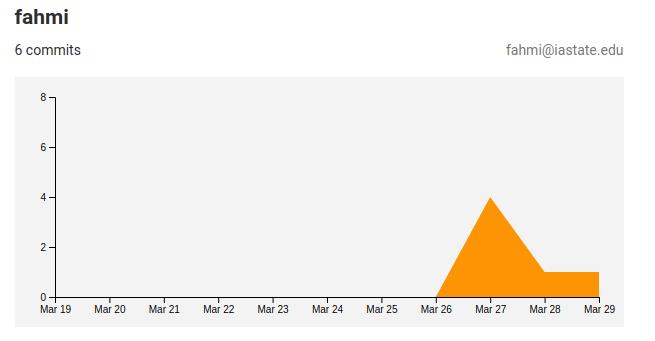
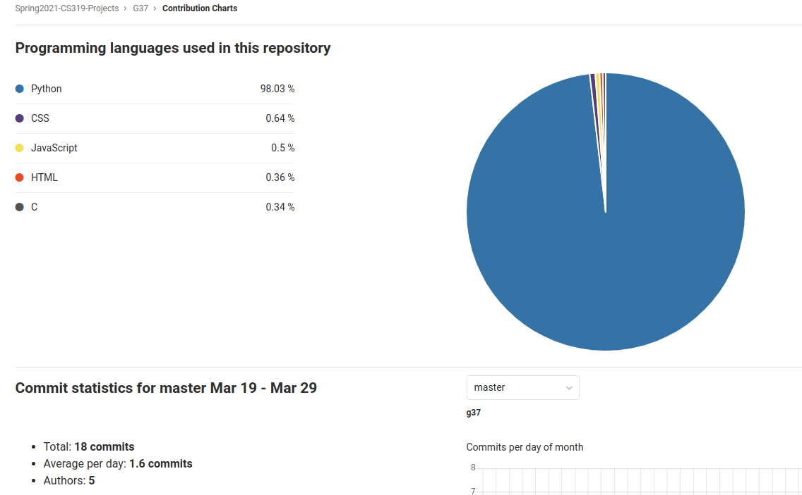

# COM S/SE 319 : Construction of User Interfaces - Spring 2021

## Individual Report for 1st Release

## Project Title: Canvas++

## Name: Akmal Fahmi Mohamad Rafie

---

### Individual Contribution and Role Description for 1st Release

- Worked on 2 story cards that focus on the backend:
  - Install React and Flask on the remote server
    - As a developer, I would like to run both frontend and backend servers on the remote server
    - Installed dependencies required for React, and Flask on the remote server
    - Created React server using `npx create-react-app frontend` command inside the project directory
    - The Flask server is much more simple, but needs to import the CanvasAPI from `pip`
    - Attempted to integrate React and Flask together with limited success (in progress)
    - Helped teammates to access the server using VSCode
    - Helped teammates use CanvasAPI to modify Canvas objects
  - Push server files to Gitlab
    - As a developer, I would like to be able to modify changes and keep track of the server files
    - Pushed the installed React, and Flask server files, so that everyone can develop, modify, and test them without having to access the server
    - Might implement CI/CD in the future

- Level of proficiency:
  
  I have used the Springboot, Java, and MySQL to develop and Android application, but this is my first time in using React and Flask (Python). We're using Flask for the backend because we want to use [CanvasAPI](https://github.com/ucfopen/canvasapi) library which is written in Python. Although it is possible to use more popular stacks like the MEAN stack (MongoDB, Express.js, Angular, Node.js), we decided to use the CanvasAPI library because it will reduce the time to write code to manipulate Canvas objects, and instead focus on implementing the REST API.

- I'm a newbie as I just recently took COM S 228, and I'm currently taking COM S 309 this semester. Nevertheless, I'm committed to learn the new frameworks for this project - React and Flask. And I will be primarily focused on Flask, and integrating React with Flask on the remote server.

- GIT Statistics/Analytics:

**Figure 1:** *My Contribution*

**Figure 2:** *Analytics*
