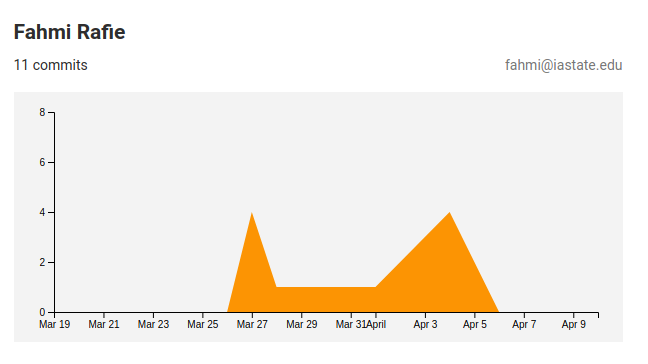
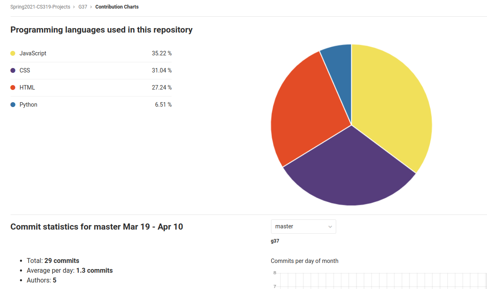

# COM S/SE 319 : Construction of User Interfaces - Spring 2021

## Individual Report for 2st Release

## Project Title: Canvas++

## Name: Akmal Fahmi Mohamad Rafie

## Group: G37

---

### Individual Contribution and Role Description for 2st Release

- Worked on story card 8: Setup API routing between frontend, and backend

- Description: [INTERNAL USER] As a developer, I would like to use the [CanvasAPI](https://github.com/ucfopen/canvasapi) to pull assignments and quizzes for individual students

- Tasks implemented:
  - Install `marshmallow` on the Flask backend server using `pip install marshmallow`

  - Implement CORS on the Flask backend server by installing it: `pip install flask_cors`, and wrapping the app with CORS: `CORS(app)`
  
  - Establish API route on the Flask backend server at [http://coms-319-g37.cs.iastate.edu:8080/events](http://coms-319-g37.cs.iastate.edu:8080/events)
  
  - Set up API route on the React frontend server using Axios
  - Configure Flask server to find all the events (assignments, quizzes) from a specific Canvas user
  - Include events due date, points possible, their course ids, and course names
  - Formatted the events and their attributes in JSON

- Issues:
  1. Earlier, we tried to make API calls to the Canvas API using only the React frontend server, but we received a CORS error. Upon further research, the problem stems from the browser's security system that disallows some scripts from running. Therefore, our scripts that contain the API calls could not be executed. The solution is to create a backend server, and we found an appropriate Python library for the Canvas API. There, we can simply set up CORS using a few lines of code

  2. Every team can edit the React frontend server files in the provided remote server. However, this requires an extra level of expertise that might delay the project. Therefore, for faster development, I set up the Flask backend server to be accessible anywhere within the ISU network at [http://coms-319-g37.cs.iastate.edu:8080](http://coms-319-g37.cs.iastate.edu:8080). Now, every team member can run their React frontend server on their local machines, and make changes easily without editing files on the remote server

  3. When sending a GET request to [http://coms-319-g37.cs.iastate.edu:8080](http://coms-319-g37.cs.iastate.edu:8080), the response should be a list of all events (assignments and quizzes). This proved to be more difficult than expected without using additional libraries. To simplify, I installed `marshmallow` which allows me to create a schema class called `Event` and append every event to a list, `eventList`. Then I simply used `json.dumps(eventList)` to create a list of events in JSON format

- GIT Statistics/Analytics:

**Figure 1:** *My Contribution*

**Figure 2:** *Analytics*
