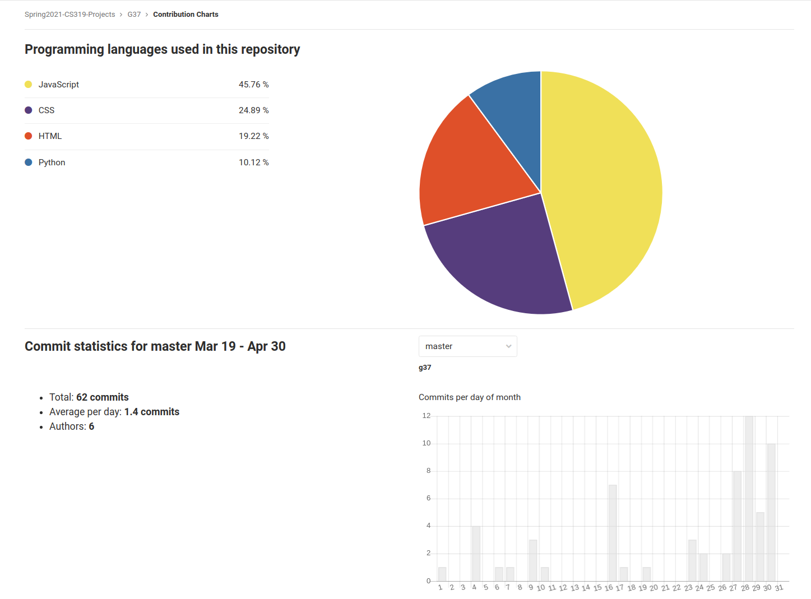

# COM S/SE 319 : Construction of User Interfaces - Spring 2021

## Final Release Individual Report

## Project Title: Canvas++

## Name: Akmal Fahmi Mohamad Rafie

## Group: G37

---

### Individual Contribution and Role Description for 2st Release

- Worked on story card 12: Setup Flask Login API

- Description: As a user, I would like to be able to login using my Canvas API token to use Canvas++

- Tasks implemented:
  - Created a login page, which is served from the Flask backend. The login page requires an API token from [https://canvas.iastate.edu/profile/settings](https://canvas.iastate.edu/profile/settings) for login. The API token needs to be generated by the user first 

  - Redirect successful login attempts to the React page. Else, show an error message to the user. This is a workaround the cookies issue that we faced, and discussed below in Issue #1
  
  - Added a logout button that will return the user back to the login page. This clears the current session in the backend, and the user will need to repeat the login process before accessing Canvas++ again 

- Issues:
  1. The login process only creates a single instance in the server, therefore only one user can use the web app at the same time at the moment. The better approach is to use cookies, but we did not have enough time figure out how to use them without issues
  2. The API token that the user generates is not intuitive, and does not adhere perfectly to [The Canvas Cloud API Terms of Service](https://www.canvaslms.com/policies/api-policy), which requires API developers to use OAuth2 protocol for applications that serve multiple users. Unfortunately for us, the OAuth2 protocol requires us to obtain developer keys from Iowa State's Canvas administrators, and these keys can give us elevated access to the API's features. However, it is unlikely that we will be given developer keys as these will essentially allow us to change almost anything associated with our Canvas accounts, including changing our grades, or removing time limits to exams

- GIT Statistics/Analytics:

**Figure 1:** *My Contribution*

**Figure 2:** *Analytics*
